# Warning: This Documentation only applies to the latest release and what is currently in this Github

We are currently working on updating these docs to match the addition of a new studio as well as updates on the original. The studio at this time is also going to be consired to be in a beta phase for version 2. All Betas for version 2 will be numbered as v0.2.#. If you are looking at trying the new betas feel free to download and try but just know there may be bugs and minimal support on getting setup. 

It is recomended to still use the lates FULL release

# Unreal Engine Esports Virtual Studio: Documentation for Setup and Use

## Overview

### What is it?

EFVS is a virtual production studio inside of Unreal Engine and designed to be used for live esports broadcasts. The project takes in camera feeds so you can place hosts, analysts, and casters in on cards in the studio. You will be able to move around this virtual studio rather than just transitioning between scenes. There is also a transition to go through a door to get into the game seamlessly from the studio.
### What You Need

Unreal Engine (version 4.27): This project was built in Unreal 4.27 and is recommended to be only used in that version. 
NDI SDK:  there are bugs with the required NDI SDK that cause crashes and bad video quality in other versions. If these issues are resolved the project may be updated. The NDI SDK is needed for bringing in NDI feeds as well as that is how the project currently outputs the camera feed that gets received into the streaming software. 
Note as of recent 5.1 mostly has issues with the NDI out built into the project meaning changing to SDI is possible with a capable physical setup. Contact for questions on that.

## Downloading the Studio File

Currently, the studio is downloadable only via direct contact w/ eFuse staff. You will most likely receive a google drive link to download a zip. Make sure to unzip the file and save in a good location.
## Opening the Studio File
Once the file is downloaded and unzipped it is recommended to move the project somewhere other than downloads(Such as the unreal projects folder in Documents). Once you are ready to launch go into the folder and look for the .uproject file and double click it to launch the project. This is the only time you will need to do this as after the first time it will stay in the epic games launcher and you will be able to launch it from there in the unreal section. If you do move the folder to a different location at any point you will need to redo that step of opening the folder and starting the project from there.

## Broadcast Setup

A basic setup for a production with the studio would be taking in NDI feeds and putting them on the desired panel and pressing play to control the camera and start the NDI out feed.

NDI is sending video over a network rather than through some sort of video cable. For more information on what NDI feeds are, click here.
### Setup Camera Feeds

#### NDI Feeds:

In order to start bringing NDI feeds into the project you need to first navigate to the NDI Folder (Content>Studio>NDI). In that folder there will be at least one NDIReceiver folder which you can open. Open the blueprint and look for the NDI source section.

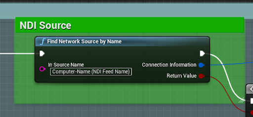

1.1 Ndi source in NDI receiver blueprints

You will put the source name of the NDI Feed into the In Source Name. You can easily find the name of your source by going into NDI Tools and opening up the studio monitor and finding your source in the dropdown. (Note: if your camera feed is stretched see the custom materials section, in customize studio, for fix)

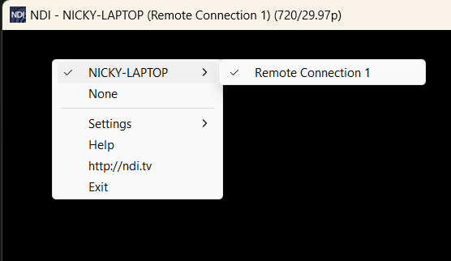

1.2 Example of finding the NDI Feed. Note you will not include the NDI - in the beginning or the resolution in the parenthesis at the end. In this case the feed is “NICKY-LAPTOP (Remote Connection 1)”.

There are many ways to set up NDI feeds on your network. If you are using vMix you can turn feeds into NDI natively in the program. Other options are using OBS with the obs-ndi plugin or even using skype calls.
#### Direct Camera Feed:

If you want to take a camera feed that is directly connected to the computer either through usb or a capture card, go to the PhysicalCamera folder also in the NDI folder. There will be at least one Cam folder. Go into one and open up the media player. You will see a small folder dropdown and in there you can look for the video source you’d like to add. After selecting make sure you copy the entire link for that source.

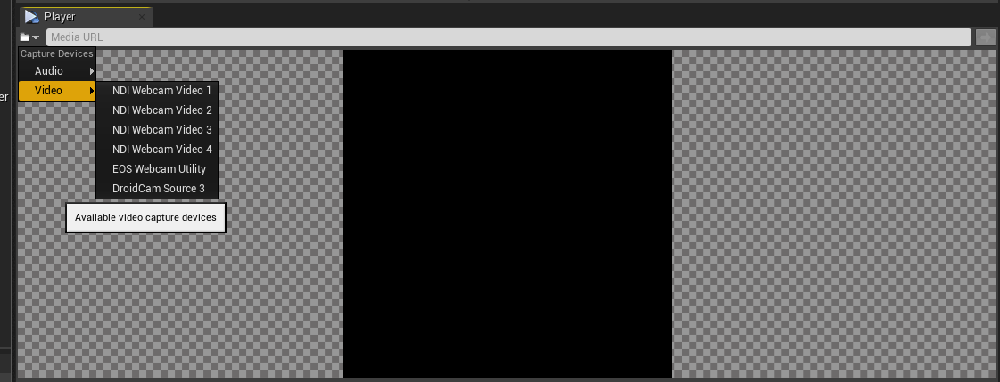

1.3 Media dropdown showing different camera sources

Go back to the physical camera folder and open the Cameras Init blueprint. In there you can edit the source your camera uses by pasting the link you copied earlier into the URL.

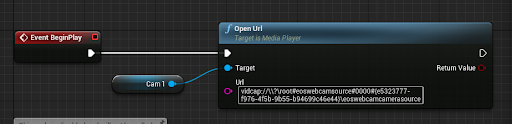

1.4 Physical cameras blueprint showing where to paste URL of video device

### Getting NDI Out Feed

The NDI out feed should automatically start when you start playing the project. From there you can go into your streaming software and add it as an NDI source (Note: Not all software supports NDI natively and you may need a plug-in).
### Controlling Camera Moves

#### HUD Controls

There are four buttons - Door, Hosts, Casters, TV - that rest below the monitoring screen, and clicking each button will trigger the camera to move to the location in the studio that corresponds to the button. 

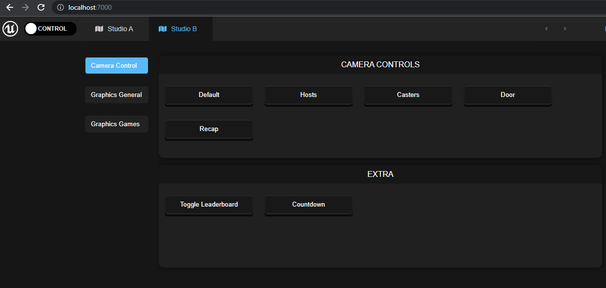

2.1 Showing example of HUD and the 4 control buttons at the bottom of the screen

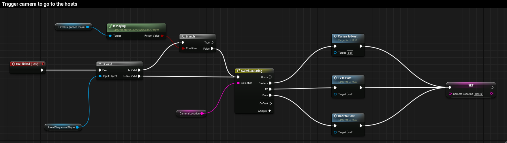

2.2 Blueprint code for the functionality behind the Hosts button

Note that once a button is pressed, the camera transition sequence will play to completion before responding to any new button presses. 

#### OSC/Companion Controls

If you use companion in your productions you are able to use that to control the unreal camera moves using OSC.

In companion you will want to go to connections and add a generic osc connection and set the target ip to the ip of the machine running unreal with port 8000. If you need to use a different port for any reason set it to another port and you will need to change a setting in unreal shown later.

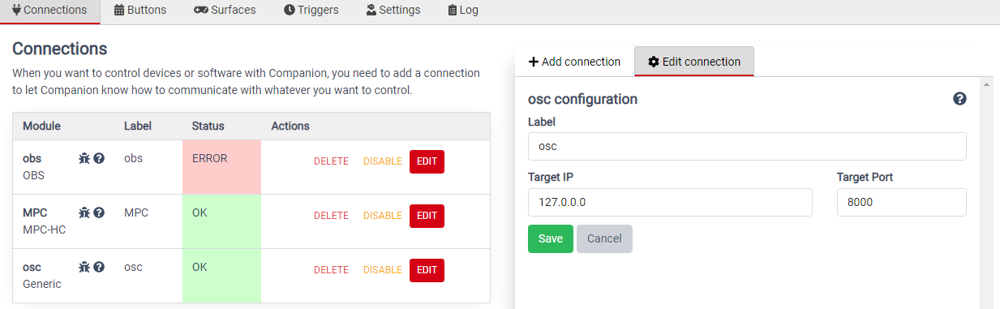

2.3 companion connections panel

Next you will want to add a new button or add to an existing button a new press action that is “osc: Send String”. The OSC Path will need to be “/unreal/location”(replace location with hosts, casters, door, or tv depending on where you are going. It is case sensitive). The value can just be left as text and the delay is up to you.

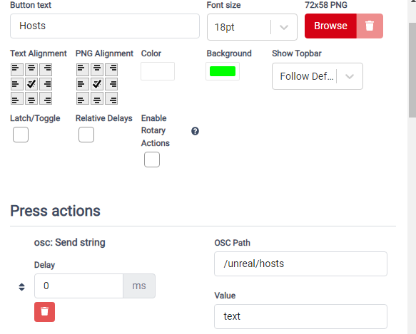

2.4 companion button new osc press action

Once added you can test the button by pressing it with unreal playing to make sure the camera moves.

If you needed to use a port other than 8000 for osc then make sure you set unreal to have the new port as well by going to Content/Studio/ControlHUD and double click on UI_HUD. In the top right switch from designer and go to Graph. Scroll down to zoom out and drag right click to move around until you see the below chunk of blueprint nodes.

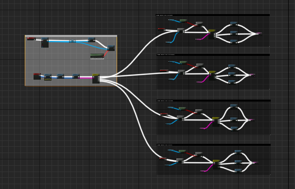

2.5 UI_HUD graph with osc

Zoom into the gray section and find the create OSCServer node(Shown below) and modify the port number to be whatever port you set in companion.

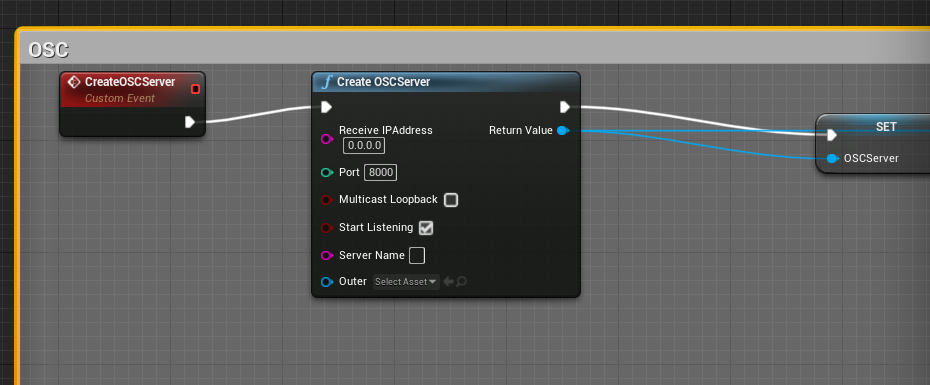

2.6 close up of Create OSCServer node 

## Customize Studio

The studio offers the ability to have as many different themes as you so please. You are also very easily able to switch between said themes.

In order to make changes to the theme of the studio, search for BP_Controller in the World Outliner to open its Details panel. The studio can be configured to display any theme from the Theme Select drop-down menu. 

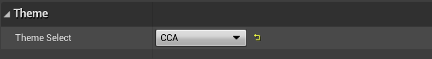

3.1 Showing the dropdown for the theme selector in the details of BP_Controller
### Add New Theme

In the content browser, under Studio/Customize/Themes, double-click ENUM_Themes to open up the asset editor. Here, the existing themes will be found. 

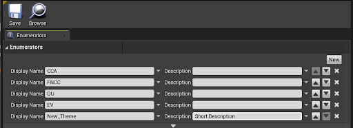

3.2 ENUM_Themes image where you can see where to add/remove any themes

To add a new theme, select new and add the name of the theme which will be displayed in the drop-down menu. Description is optional but is useful as it displays while hovering over the abbreviated names in the dropdown. 

After this, proceed to Studio/Customize/Themes and open up DT_Themes. Click on (+) Add to add a new row. 

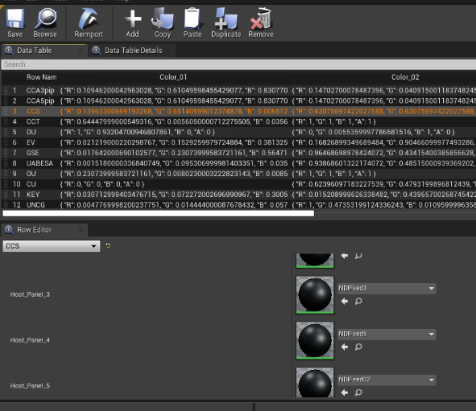

3.3 Shown above is the data table, DT_Themes, that stores all of the info for the themes

Make sure the Row Name matches the Display Name entered in ENUM_Theme. In the row editor(Seen in the bottom half of 3.3), choose the assets that fit the theme best using the dropdowns or colors selector. This is where you will set which NDI Feed materials, or logos, will go on which Host panels. As shown in 3.3 you can see the feeds are named “NDFeed#”. You can also change what goes on the different monitors in the front, back, and side of the studio.
### Uses For Multiple Different Themes

#### Have Multiple Branded Studios

In the row editor, the primary and secondary colors of the studio can be set along with the type of materials for each screen. The purpose of Monitor_Front, Monitor_Back, and Monitor_Side materials is to display branding.

Textures for these materials can be set by creating an instance of the M_Monitor material under Assets/Materials/LEDWalls. In the Details panel of the material instance, click on the checkbox that says Monitor Graphic and then set the desired texture to be displayed on the monitor. 

Make sure that the texture is at least a 1920 x 1080 png image for better quality.

Having the different branded studios allows the studio to be more versatile and can be customized per event that is done. For example it gets used for FNCC Solos and Trios, both of which get streamed by the same people but the branding is there for both.
#### Multiple Versions of Same Branding

A particular theme for the studio can have several versions by changing the placement of the branding and the NDI feeds. All screens are designed to display both static branding images as well as NDI feeds. This allows you to even have the exact same branding but quickly swap between different numbers of casters or even their positioning.
### Custom Materials

#### Adding new logo

These are for logos that you will be adding to the host panels

If you want to add a new logo into your theme then you will first need to import your square image by dragging and dropping it into a folder(Content/Assets/Textures/Logos).Once imported go to Content/Assets/Materials/LEDWalls. In this folder you will see M_LogoMonitor which you will right click and click create material instance.

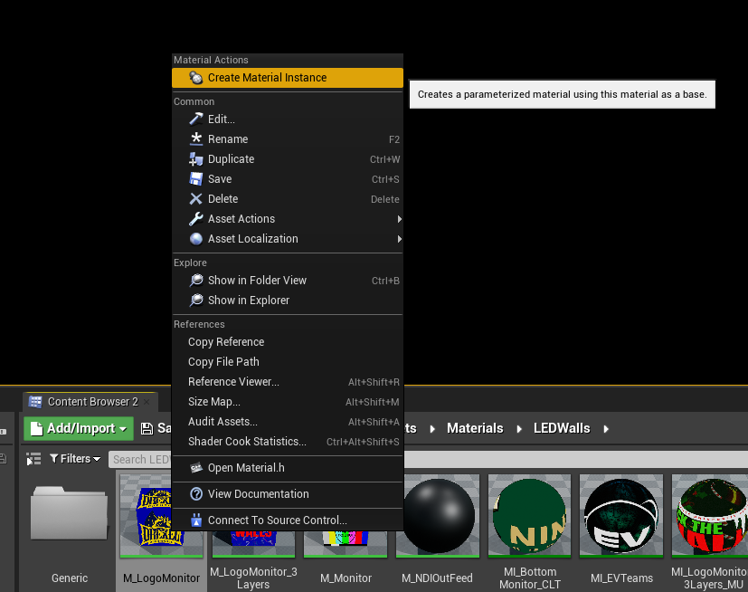

3.4 create instance of M_LogoMonitor

Name the material something you will easily find later(ex. MI_LogoMonitor_efuse). Once created and renamed, double click on the material, opening a new window to edit its properties.

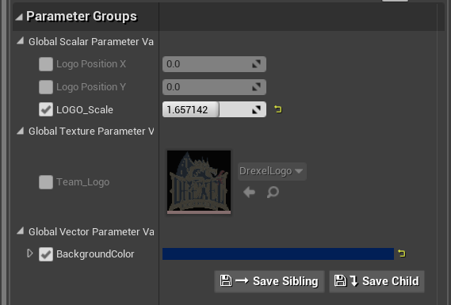

3.5 properties of instance of M_LogoMonitor

Any properties you want to change make sure that the check mark is on next to that property. If your image is just a transparent logo then you can add a background color. You can also change the position and scale the logo to better fit the screens.

Once finished make sure you save and you now are able to go into the themes and add this material into any theme.

#### Adding new screen graphic

These are 16:9(1920x1080) graphics that are to be displayed on any screens(Front, back, or side)

First you need to import your 16:9 image by dragging and dropping it into a folder(Content/Assets/Textures/Screens).Once imported go to Content/Assets/Materials/LEDWalls. In this folder you will see M_Monitor which you will right click and click create material instance.

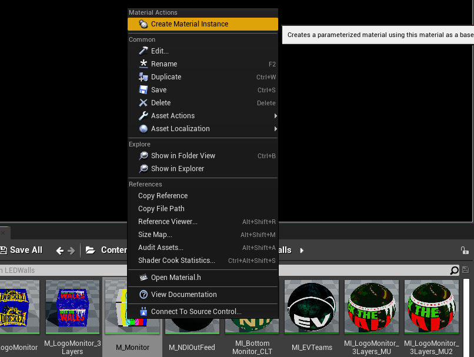

3.6 create instance of M_Monitor

Name the material something you will easily find later(ex. MI_Monitor_efuse). Once created and renamed, double click on the material, opening a new window to edit its properties.

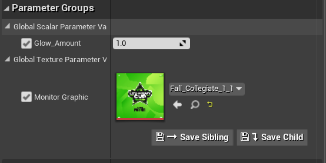

3.7 properties of instance of M_Monitor

Any properties you want to change make sure that the check mark is on next to that property. You can add your graphic and change how much it glows on the screen.

Once finished make sure you save and you now are able to go into the themes and add this material into any theme.
#### Adjusting NDI Feeds

In each of the NDIReciever folders there is a material instance named NDIFeed#. You can open up that material and adjust all of the settings to fit your needs. You can always just use the default values by either pressing the arrow to the right of the parameter or by making sure all parameter customizations are disabled by leaving them unchecked.
## Troubleshooting

### NDI Issues

#### Screens that should have feed are showing up just black

If you have an issue where you are not seeing your NDI feed show up make sure you do these checks
Make sure that your NDI feed is not showing black. You can confirm this by using NDI Tools and checking using the Studio Monitor to see if your feed is showing the correct feed. (Image 1.2 shows Studio Monitor)
Double/Triple check that the Source name you put into the blueprint(Seen in 1.1) matches the NDI feed you are trying to put onto the panel.
Check that you are using the correct theme and that your theme is using the correct NDI feeds, that you are currently adjusting, and have them on the correct panels. (Example in 3.3)
####Error on project launch

If you have an error show up once the project loads and mentions issues with NDI make sure you have properly installed the NDI SDK for UE 4.27 found here.

### Physical Camera Issues

#### Camera link pasted in correct spot still not working

There is a chance that you are using a webcam or camera that has multiple different channels. If you have another camera that is a different brand/model to use/test with it is recommended to try switching to that camera first. If that doesn’t work or you don’t have another camera to use, look into changing the channel using blueprints. Unfortunately as of now we have not been able to test a camera with this issue so we do not have a solid guide on solving this.
### Datatable Issues

#### Color put in with Hex code doesn’t look right.

Inside unreal when selecting a color to use there are 2 different types of hex codes you can put in. It is most likely that you are not using the correct spot for your type of Hex code. Linear hex codes are more common and are likely where you should enter the code.
#### Can’t find logo/screen/panel graphic that was just imported

Graphics that were just imported by dragging and dropping in an image come in as texture but the data table is set up to only take in material instances. You can create a new instance of the already existing materials based on what you are adding. For example if you are bringing in a logo, create an instance of the M_Logo and open it adding the logo you want to add then search for that instance in the dropdown in the database.
###Logo/Screen Issues

#### Graphic(s) looks stretched on screen

This is a combination of a few things. The biggest issue is probably that you are using an image that is not the correct scale for the screen. The top/bottom/side screens all need 16:9(such as 1920x1080). Images but could also be on a material not designed to go on the screens. Make sure the image(s) are the correct scale and on the correct material. You may also need to go into the settings of the material/material instance and adjust any scale parameters if they are options.

For further support, please contact Ben Scragg: bscragg@efuse.io.
