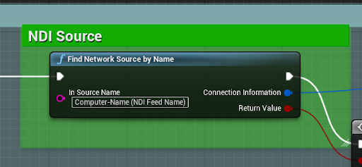
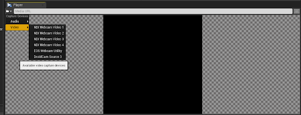
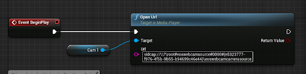
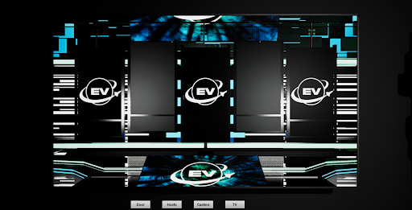
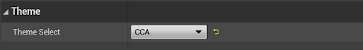
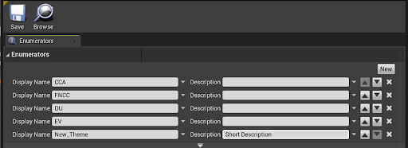
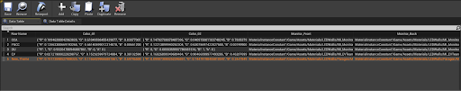

# Unreal Engine Esports Virtual Studio: Documentation for Setup and Use
## Overview
### What is it?
EFVS is a virtual production studio inside of Unreal Engine and designed to be used for live esports broadcasts. The project takes in camera feeds so you can place hosts, analysts, and casters in on cards in the studio.

Examples of use:

[Clip 1](https://www.twitch.tv/collegecarballfn/clip/ProtectiveRoundSwordBatChest-rlE-b7q3RySsUMKZ)
[Clip 2](https://www.twitch.tv/collegecarballfn/clip/FrozenTawdryVelociraptorPlanking-bojWXJlFZqPaMoFA)
[Clip 3](https://www.twitch.tv/collegecarballfn/clip/CarefulGiantYakinikuStinkyCheese-DKcP_NMkYEHgAlgg)
[Clip 4](https://www.twitch.tv/collegecarballfn/clip/TameAbnegateDoveBigBrother-GjIJ_4c6X1KSU6D1)

### What You Need
This project was built in Unreal 4.27 and is recommended to be only used in that version. It might function in other versions, but there are bugs with the required NDI SDK that cause crashes in other versions. If these issues are resolved the project may be updated. 
## Broadcast Setup
A basic setup for a production with the studio would be taking in NDI feeds and putting them on the desired panel and pressing play to control the camera and start the NDI out feed.

For more information on what NDI feeds are, how to click here.
### Setup Camera Feeds
**NDI Feeds:**
In order to start bringing NDI feeds into the project you need to first navigate to the NDI Folder (Content>Studio>NDI). In that folder there will be at least one NDIReceiver folder which you can open. Open the blueprint and look for the NDI source section.

You will put the source name of the NDI Feed into the In Source Name.

**Direct Camera Feed:**
If you want to take a camera feed that is directly connected to the computer either through usb or a capture card go to the PhysicalCamera folder also in the NDI folder. There will be at least one Cam folder. Go into one and open up the media player. You will see a small folder dropdown and in there you can look for the video source you’d like to add. After selecting make sure you copy the entire link for that source.

Go back to the physical camera folder and open the Cameras Init blueprint. In there you can edit the source your camera uses by pasting the link you copied earlier into the URL.

### Getting NDI Out Feed
The NDI out feed should automatically start when you start playing the project. From there you can go into your streaming software and add it as an NDI source (Note: Not all software supports NDI natively and you may need a plug-in).
### Controlling Camera Moves
There are four buttons - Door, Hosts, Casters, TV - that rest below the monitoring screen, and clicking each button will trigger the camera to move to the location in the studio that corresponds to the button. 

*Blueprint code for the functionality behind the Hosts button*

Note that once a button is pressed, the camera transition sequence will play to completion before responding to any new button presses. 
## Customize Studio
In order to make changes to the theme of the studio, search for BP_Controller in the World Outliner to open its Details panel. The studio can be configured to display any theme from the Theme Select drop-down menu. 

### Add New Theme
In the content browser, under Studio/Customize/Themes, double-click ENUM_Themes to open up the asset editor. Here, the existing themes will be found. 

To add a new theme, select new and add the name of the theme which will be displayed in the drop-down menu. Description is optional. 

After this, proceed to Studio/Customize/Themes and open up DT_Themes. Click on (+) Add to add a new row. 

Make sure the Row Name matches the Display Name entered in ENUM_Theme. In the row editor, choose the assets that fit the theme best. 
### Uses For Multiple Themes
Have Multiple Branded Studios
In the row editor, the primary and secondary colors of the studio can be set along with the type of materials for each screen. The purpose of Monitor_Front, Monitor_Back, and Monitor_Side materials is to display branding.

Textures for these materials can be set by creating an instance of the M_Monitor material under Assets/Materials/LEDWalls. In the Details panel of the material instance, click on the checkbox that says Monitor Graphic and then set the desired texture to be displayed on the monitor. 

Make sure that the texture is at least a 1920 x 1080 png image for better quality. 
Multiple Versions of Same Branding
A particular theme for the studio can have several versions by changing the placement of the branding and the NDI feeds. All screens are designed to display both static branding images as well as NDI feeds.

For further support, please contact Ben Scragg: bscragg@efuse.io.
